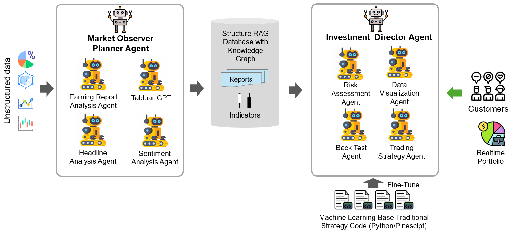

# Welcome

We are developing a GenAI Agent platform specifically designed for the fintech
sector, with a focus on investment and trading in both stock and cryptocurrency
markets. So Everyone can explore and execute their own Holy Grail with their own
free GenAI fund manager with huge data science algorithms, live real-time strategy,
excellent coding capability. (_NOTE: the agent platform is not to create strategy
but help to implement, back-test, and execute strategy._)

Our long-term goal is to evolve the GenAI Agent from a proof-of-concept component into a
production-ready platform, with significant enhancements in trustworthiness,
security, and scalability.

Achieving "automotive-level" intelligence can be accomplished through the
integration of Large Language Models (LLM) with external knowledge sources,
either via Retrieval-Augmented Generation (RAG) or fine-tuning, along with the
use of various tools. Reaching "closed-loop" level automation requires the
deployment of multiple domain-specific agents. Ultimately, achieving full automation
necessitates the collaboration of these agents.
