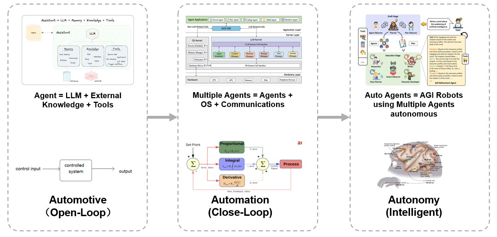

# Welcome

This community is committed to productizing AI Agents, such as in the financial
field, to build a reliable, trustworthy, and scalable open source AI agent
platform.

The intelligence in "automotive level" can be achived via LLM + External knowledge
(via RAG or Fine-tune) + Tools; The "close-loop" level automation need multiple
domain specific agents; The final automation need collaborations of agent.

In a real product, there are more considerations like trustworhy, security, hybird
model's orchestration etc.

We are building a production ready platform for the fintech vertical and scale
to more verticals.

